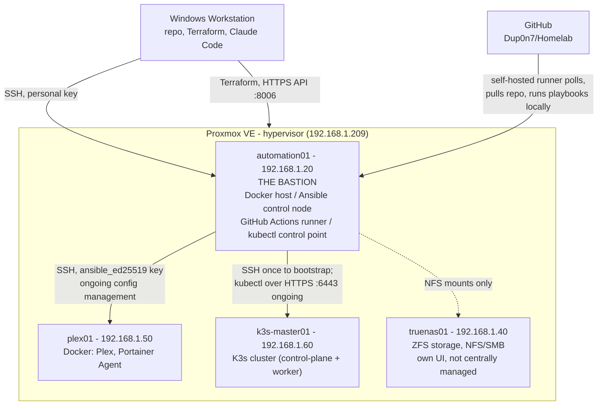

# System Map

A living diagram of every machine in this lab, what runs on each, and exactly how they connect. Update this whenever a host, connection, or responsibility changes — it should always match reality, not the plan. For the reasoning behind any of these decisions, see [Terraform.md](Terraform.md), [Ansible.md](Ansible.md), and [Kubernetes.md](Kubernetes.md).

## The core idea

**One machine holds the keys and the tools; everything else just gets reached out to.** `automation01` is the *bastion host* — the single console you (or a tool) go to in order to act on anything else in the lab, rather than SSHing into each host individually. The one exception is Terraform, which runs directly from the Windows workstation because it's a native Windows binary with no need for a Linux control node.

## What lives where

| Host | IP | Role | Managed via |
|---|---|---|---|
| **automation01** | `192.168.1.20` | Docker host (n8n, Postgres, MCP servers, Homepage) + the bastion for everything below | Terraform (VM) → Ansible (`ansible_connection=local`) |
| **plex01** | `192.168.1.50` | Docker host — Plex, Portainer Agent | Terraform (VM) → Ansible, over SSH from automation01 |
| **truenas01** | `192.168.1.40` | ZFS storage, NFS/SMB exports | Its own web UI, deliberately not Ansible-managed — see [Ansible.md](Ansible.md) "Open questions" |
| **k3s-master01** | `192.168.1.60` | Single-node K3s cluster (control-plane + worker combined) | Terraform (VM) → Ansible (one-time bootstrap only) → `kubectl` from automation01 (day to day) |

## Key distinction: SSH access vs. ongoing control

Not every line on the diagram means the same thing:

- **automation01 → plex01**: Ansible reaches out over SSH *every time* a playbook runs. Ongoing.
- **automation01 → k3s-master01**: SSH was only used *once*, to install K3s and fetch its credentials file. Day-to-day, `kubectl` talks straight to the Kubernetes API over the network (port `6443`) — no SSH involved at all.
- **automation01 → truenas01**: not managed at all in the Ansible/Terraform sense — just a network path for mounting NFS shares. TrueNAS is administered through its own UI.

## What's on GitHub Actions

The self-hosted runner isn't a separate machine — it's a background process (systemd service) running *on* `automation01`. GitHub doesn't push jobs to it; the runner continuously polls GitHub for work, and when it finds a job, it pulls this repo and executes the workflow locally, using whatever's already on `automation01` (Ansible, the `ansible_ed25519` key, `kubectl`).
